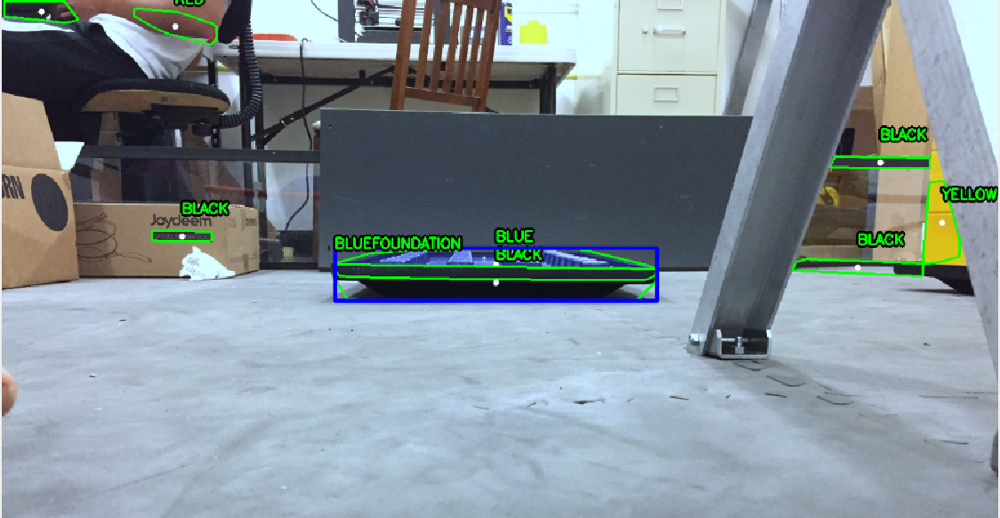
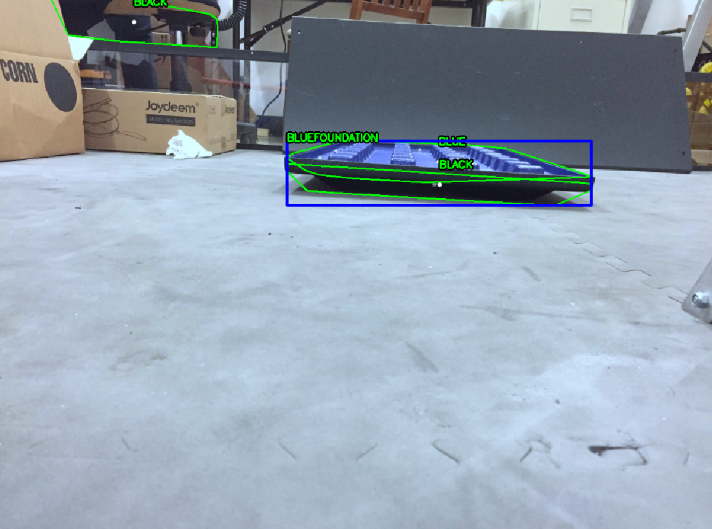
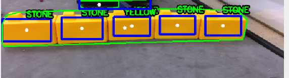
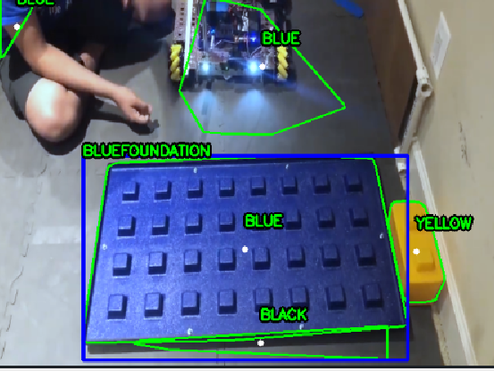
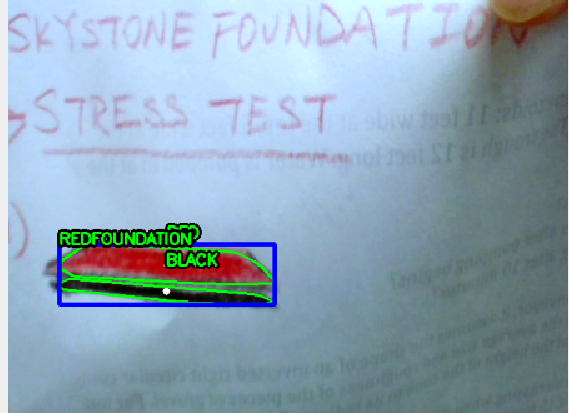
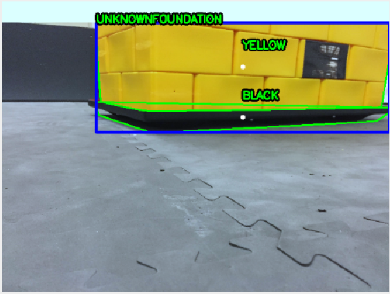

# FTC Team #14473 Future - Image processing Framework [Currently in Intense Development]

This library was made to simplify the agony in doing FTC computer vision in Java.   
It follows very simple rules:

- It can be used for all seasons. This code will always be useful unless FTC changes their software setup.

- If you don't need it, you should never see it. All the boilerpalce nitty gritty is handled by magick.

## Features

- OpenCV Foundation Detection (Pretty good 95%) Pipeline: https://github.com/Future14473/CV-for-SkyStone-FTC/blob/master/bluejay/src/main/java/org/futurerobotics/bluejay/original/detectors/FoundationPipeline.java
- Opencv Stone Detection (Pretty good 95%)
- Tensorflow Stone Detection (not as good as openCV)
- Localization with Vumarks
- IMU Interface
- All the above running simultaneously

## Super Quick Start for Rookie Teams
I personally won't recommend doing this for the long run, but if you just need something to **work** then follow these steps:

1. Go to the `Releases` Tab and download this as a .zip Android Studio Project
2. Unzip the library
3. Open Android Studio and go to File > new > existing project >**where you unzipped the library**
4. Download to your RC
5. Run <<Three systems>> opmode
6. Positioning data will be printed via telemetry, if you want to plug the data elsewhere, find the Telemetry calls in the file `Douduo` and match the labels from the DS telemetry log

* Note: I know that this download is >1GB, but it will save you the frustration of setup. It already has **everything**
## Proper Start for the Minority who care
_Disclaimer: This is a messy way to do it, and overly simplified in its methology. It may not be responisble but it works_
1. Clone and make a new project from VCS in Android Studio. Code is in the `Original` folder. We might refactor into a module, but think this way is easier
2. Install opencv for android version 3.4.3 into your project
3. Fix dependencies by clicking the suggested links in your build window
4. If if dosent work, go to the `build.gradle` and `build.releases.grade` folders in the Android File View. This is where IntelliJ writes down for real what all the dependencies for each module are. All the import UI is just an illusion. Go fix __that__. The details are beyond the scope of this readme

## Using the Library
First off, working code for everyone

		@TeleOp(name = "The Three <<Holy Systems>>", group = "Primordial Artifact")
		public class DuoDou extends LinearOpMode {
	    	 public void runOpMode() {

				telemetry.setAutoClear(true);

				ImageDetector detector = new ImageDetector(this, false);
				StoneDetector stone = new StoneDetector(this, true);
				OpencvDetector foundation = new OpencvDetector(this);
				IMU imu = new IMU(this);

				stone.start();
				detector.start();
				foundation.start();
				imu.start();

				while (!isStopRequested()) {
					detector.printposition(detector.getPosition());

				    	foundation.print(foundation.getObjects());

				    	stone.print(stone.getObjects());
                                         
                        detector.printposition(imu.getPosition());

				    	telemetry.update();
				}

				// Disable Tracking when we are done;
				detector.stop();
				stone.stop();
				foundation.stop();
				imu.stop();
			    }
			}
		}	

All classes that the user uses follow a simple guideline: a constructor with clear parameter requirements, a `start()` method to begin computing, a `stop()` method to stop computing, and one method with `get` at the beginning of its name. This returns whatever the class is used for.

For example:

	ImageDetector detector = new ImageDetector(this, false);
	detector.start();

Is used to get the Vuforia localizer running. It requires an opmode instance and a boolean for whether the RC should display its view.

Please realize the purpose of the `start()` and `stop()` methods. We've made a careful decision to include them even though they make the library more complicated. Keeping all the detectors active (ie. calling start() for each) will cause your framerate to plummet and latency to increase.

To request data, simply do:

	detector.getPosition();

And, for this class, will return an orientation() object. You can figure this out.

Each class has an additional method that formats and sends its data output to Telemetry. ImageDetector has printPosition(orientation o) that will format and print the aforementioned orientation object

So you can do:
		
	orientation o = detector.getPosition();
	detector.printPosition(o);
	
Or: 

	detector.printPosition(detector.getPosition());
	
Everything else is the same, but the Stone detector will return `recognition` objects and the Cv detector will return `Point` objects. These are all well documented and each class has the method that will format and interpret it for you.

A note: the IMU class, as a non-absolute Localizer, will always return the difference in position since __the last time you called its getter method__. That means that if the robot spins more than 360 degrees between that time, you will have an unreliable rotational reading.
	

## Contact
If you got questions, email me at <xchenbox@gmail.com> or alternatively, find us on Facebook <https://www.facebook.com/future14473>
We don't have a discord (yet). If there's any problems or ambiguity, shoot me an email

## Gallery

