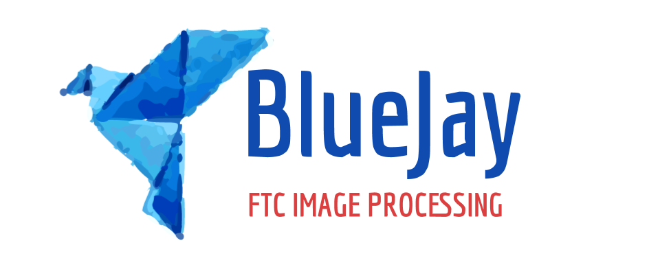

# BLUEJAY 2.0
## FTC Image Processing

Brand-new BlueJay, more robust and more generalized!
- Use it for any past or future competition
- Build your own processing algorithm

See releases for the Skystone-specific 2019 BlueJay

Pardon the lack of README and resources. Still working on speed, stability, porting to android, etc.

This is a pure Java project at the moment for ease of testing. Clone in your favorite IDE and add opencv 3.4.3 as a dependency.
